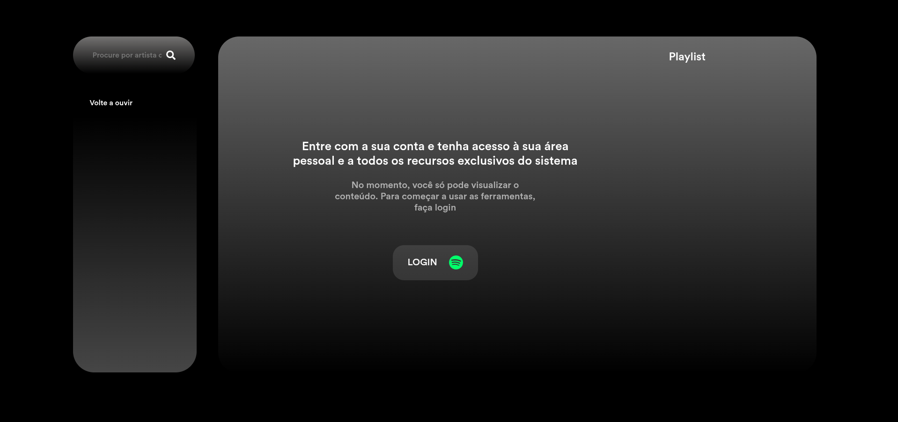

# 🎧 Spotify Clone

Um projeto front-end inspirado na interface do Spotify, recriado com HTML, CSS e JavaScript para fins de estudo e prática de design responsivo e manipulação dinâmica da DOM.



## 📜 Índice

* [Sobre o Projeto](#-sobre-o-projeto)
* [Funcionalidades](#-funcionalidades)
* [Tecnologias Utilizadas](#-tecnologias-utilizadas)
* [Estrutura de Pastas](#-estrutura-de-pastas)
* [Como Executar o Projeto](#-como-executar-o-projeto)
* [Melhorias Futuras](#-melhorias-futuras)
* [Autor](#-autor)
* [Licença](#-licença)

## 💡 Sobre o Projeto

Este projeto é uma recriação da interface do Spotify Web, com foco em:

* Reproduzir a experiência visual do Spotify Desktop.
* Aplicar conceitos de layout flexível e responsivo.
* Simular interações básicas de um player musical (sem backend real).

O objetivo principal foi praticar HTML semântico, CSS moderno (Flexbox e Grid) e JavaScript puro para manipulação de componentes dinâmicos.

## ⚙️ Funcionalidades

✔️ Interface semelhante ao Spotify oficial
✔️ Menu lateral com ícones interativos
✔️ Área principal com lista de álbuns e playlists
✔️ Barra inferior simulando o player (play/pause, progresso, etc.)
✔️ Design totalmente responsivo
✔️ Ícones animados e suaves transições com hover

## 🧩 Tecnologias Utilizadas

* **HTML5** — Estrutura semântica e organizada
* **CSS3** — Layouts modernos usando Flexbox e Grid
* **JavaScript (ES6+)** — Manipulação da DOM e interações
* **Google Fonts / Spotify Colors** — Tipografia e identidade visual inspiradas na marca original

## 📂 Estrutura de Pastas

```

📁 spotify-clone/
┣ 📂 src/
┃ ┣ 📂 img/           \# Imagens e ícones do projeto
┃ ┣ 📂 css/
┃ ┃ ┗ 📜 style.css    \# Estilos principais
┃ ┣ 📂 js/
┃ ┃ ┗ 📜 app.js       \# Scripts de interatividade
┣ 📜 index.html        \# Página principal
┗ 📜 README.md         \# Este arquivo

````

## 🚀 Como Executar o Projeto

1.  Faça o download ou clone o repositório:

    ```bash
    git clone [https://github.com/seu-usuario/spotify-clone.git](https://github.com/seu-usuario/spotify-clone.git)
    ```

2.  Entre na pasta do projeto:

    ```bash
    cd spotify-clone
    ```

3.  Abra o arquivo `index.html` em seu navegador preferido.
    * Clique duas vezes no arquivo `index.html`, ou
    * Utilize uma extensão como **Live Server** (VS Code) para melhor experiência.

## 🔧 Melhorias Futuras

✨ Implementar player funcional com JavaScript (play/pause real).
✨ Adicionar integração com API do Spotify (autenticação OAuth).
✨ Criar modo escuro/claro alternável.
✨ Adicionar responsividade para telas menores com menu recolhível.

## 👨‍💻 Autor

* **Roger Ribeiro de Oliveira**
* 📍 Desenvolvedor de Sistemas — SENAI
* 💼 [LinkedIn](https://www.linkedin.com/)
* 💻 [GitHub](https://github.com/)

## 🪪 Licença

Este projeto é de uso educacional e não comercial.
Sinta-se à vontade para clonar, modificar e aprender com ele!
